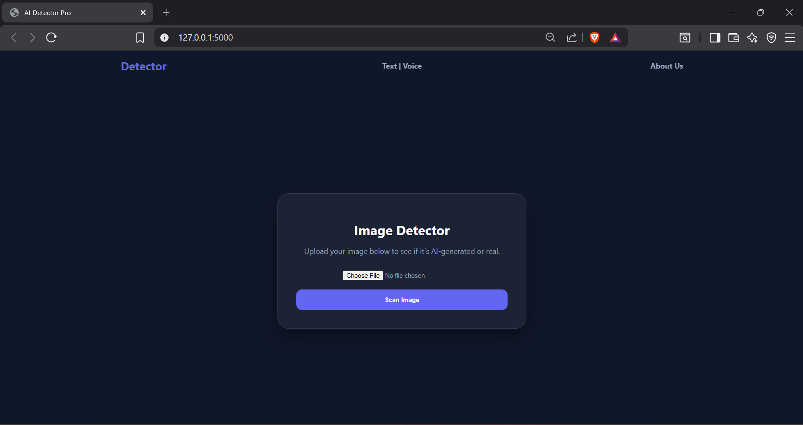
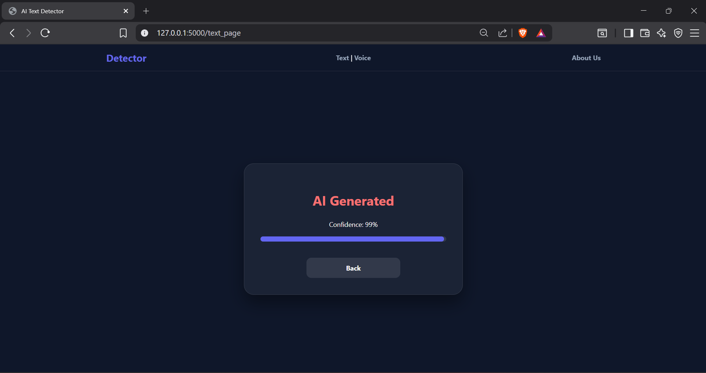
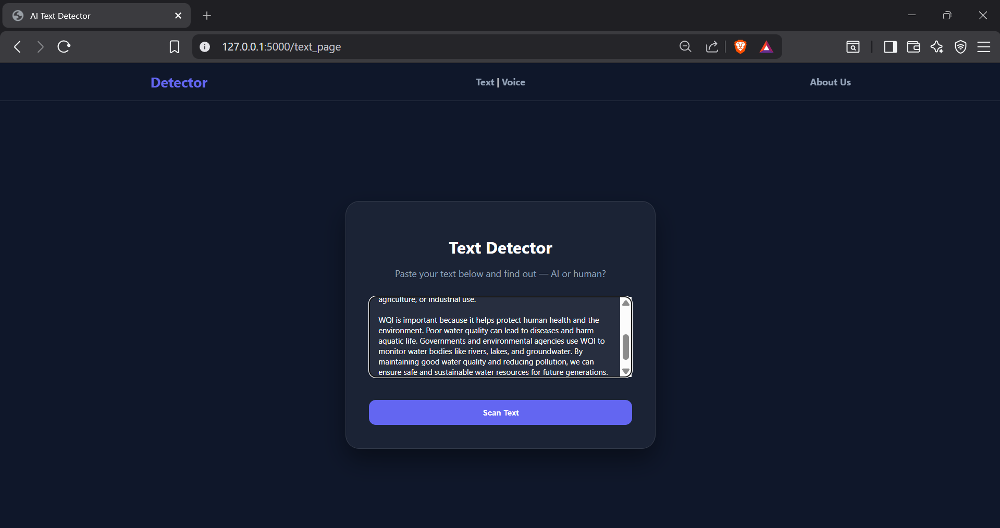
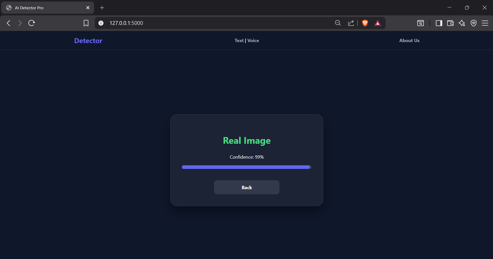

# 🧠 AI Detection System (Image + Text + Voice)

A powerful AI-based web application that detects whether **images, text, and voice** are AI-generated or real. This system integrates multiple machine learning models into a single user-friendly web interface.

---

## 📌 Overview

This project aims to identify AI-generated content across multiple domains:

- 🖼️ Image Detection  
- 📝 Text Detection  
- 🎤 Voice Detection  

Users can upload or input data, and the system will analyze it using trained deep learning models to provide predictions with confidence scores.

---

## 🚀 Features

- 🖼️ Detect AI-generated images  
- 📝 Detect AI-written text  
- 🎤 Detect synthetic (deepfake) voice  
- ⚡ Real-time prediction with confidence score  
- 🌐 Web interface using Flask  
- 🎨 Modern UI with glassmorphism design  

---

## 🛠️ Tech Stack

- **Backend:** Python, Flask  
- **Frontend:** HTML, CSS  
- **AI Models:**  
  - Image: SDXL Detector  
  - Text: RoBERTa-based model  
  - Voice: Wav2Vec2 Deepfake Detection  
- **Libraries:** PyTorch, Transformers, Librosa, PIL  

---

## ⚙️ How It Works

### 🖼️ Image Detection
- Upload image  
- Model analyzes frequency artifacts  
- Classifies as Real or AI-generated  

### 📝 Text Detection
- Input text  
- RoBERTa model analyzes linguistic patterns  
- Detects AI-generated vs Human-written  

### 🎤 Voice Detection
- Upload audio (.wav / .mp3)  
- Wav2Vec2 analyzes speech patterns  
- Detects synthetic vs human voice  

---

## 📂 Project Structure
AI-detection/
│── app.py
│── requirements.txt
│── README.md
│
├── templates/
│ ├── index.html
│ ├── text_detector.html
│ ├── voice_detector.html
│ └── about.html
│
├── static/
│ └── style.css

---

## ▶️ Usage

- Run the application  
- Open browser: http://127.0.0.1:5000  
- Choose:
  - Image Detection  
  - Text Detection  
  - Voice Detection  
- Upload/input data  
- Get prediction instantly  

---

## 📸 Screenshots

### 🏠 Home Page

### 🧠 Detection Result

### 📝 Text Input

### 📊 Final Output

---

## 🔮 Future Scope

- Improve model accuracy with larger datasets  
- Add real-time camera detection  
- Support video deepfake detection  
- Deploy on cloud (AWS / Render)  
- Add user authentication system  

---

## ⚠️ Limitations

- Accuracy depends on model and dataset  
- Short text inputs may reduce reliability  
- Audio quality affects prediction accuracy  

---

## 👨‍💻 Author

- Yug Patel  

---

## 🎯 Conclusion

This project demonstrates how multiple AI models can be integrated into a single system to detect AI-generated content efficiently. It showcases practical implementation of machine learning in real-world applications.
